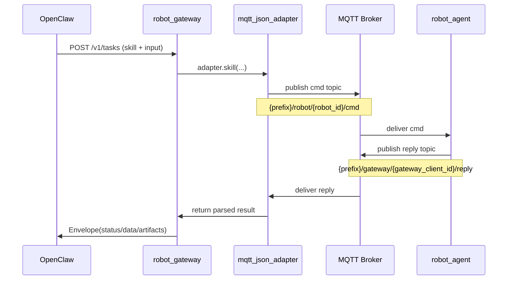

# HRD-wheel 总览

本仓库包含两个核心子项目：

- `robot_gateway`：数据面网关（FastAPI），对上提供 `/v1/tasks*` 协议
- `robot_agent`：机器人侧 ROS2 Agent，通过 MQTT JSON 执行技能并回包

## 1. 整体调用图（包含 skill cmd/reply）

```mermaid
flowchart LR
    A[OpenClaw / 控制面] -->|HTTP: POST /v1/tasks| B[robot_gateway]
    B -->|调用 adapter| C[mqtt_json_adapter]
    C -->|publish cmd topic| D[(MQTT Broker)]
    C -.->|prefix/robot/robot_id/cmd| D
    D -->|deliver cmd| E[robot_agent capture_agent_node]
    E -->|publish reply topic| D
    E -.->|prefix/gateway/gateway_client_id/reply| D
    D -->|deliver reply| C
    C --> B
    B -->|HTTP: Envelope| A

    B -.可选实时事件.->|WS /v1/tasks/{task_id}/events| A
```

## 2. 一次技能调用的时序图



## 3. MQTT 契约（通用）

### 3.1 cmd（Gateway -> Agent）

```json
{
  "protocol": "mqtt-json-v1",
  "timestamp": 1710000000,
  "correlation_id": "corr-abc123",
  "reply_to": "hrd/gateway/gateway-xxxx/reply",
  "action": "get_status | get_position | move_to | capture_image",
  "payload": {}
}
```

### 3.2 reply（Agent -> Gateway）

```json
{
  "protocol": "mqtt-json-v1",
  "timestamp": 1710000001,
  "correlation_id": "corr-abc123",
  "ok": true,
  "data": {}
}
```

失败时：

```json
{
  "protocol": "mqtt-json-v1",
  "timestamp": 1710000001,
  "correlation_id": "corr-abc123",
  "ok": false,
  "error": "..."
}
```

## 4. Skill 的 cmd/reply 明细

### 4.1 get_status

cmd:

```json
{
  "action": "get_status",
  "payload": {}
}
```

reply.data（Agent 返回，Gateway 重点消费 `battery/mode`）：

```json
{
  "battery": 0.76,
  "mode": "AUTO",
  "robot_id": "robot-001",
  "state": "idle",
  "position": {"frame_id": "map", "x": 0.0, "y": 0.0, "z": 0.0, "yaw": 0.0},
  "last_action": "get_status",
  "last_error": ""
}
```

### 4.2 get_position

cmd:

```json
{
  "action": "get_position",
  "payload": {}
}
```

reply.data（Gateway 重点消费 `frame_id/x/y/yaw`）：

```json
{
  "position": {"frame_id": "map", "x": 1.2, "y": 3.4, "z": 0.0, "yaw": 0.5},
  "frame_id": "map",
  "x": 1.2,
  "y": 3.4,
  "z": 0.0,
  "yaw": 0.5
}
```

### 4.3 move_to

cmd（常见）：

```json
{
  "action": "move_to",
  "payload": {
    "location": null,
    "timeout_seconds": 4,
    "pose": {"frame_id": "map", "x": 8.0, "y": 3.0, "yaw": 0.5}
  }
}
```

reply.data（Gateway 重点消费 `accepted/message/final_pose/ros2_meta`）：

```json
{
  "accepted": true,
  "message": "ROS2 nav command accepted and completed",
  "final_pose": {"frame_id": "map", "x": 8.0, "y": 3.0, "yaw": 0.5},
  "ros2_meta": {
    "adapter": "robot_agent_capture_node",
    "action_server": "/navigate_to_pose",
    "goal_id": "goal-1710000000",
    "result_code": 0
  }
}
```

### 4.4 capture_image

cmd:

```json
{
  "action": "capture_image",
  "payload": {"camera": "front"}
}
```

reply.data（Gateway 重点消费 `image_jpeg_base64/mime/width/height`）：

```json
{
  "camera": "front",
  "mime": "image/jpeg",
  "width": 1280,
  "height": 720,
  "image_jpeg_base64": "..."
}
```

## 5. 关键代码入口

- Gateway 协议入口：`robot_gateway/app/main.py`
- Gateway MQTT 适配器：`robot_gateway/app/adapters/mqtt_json_adapter.py`
- Agent MQTT 处理与 action 分发：`robot_agent/robot_agent/capture_agent_node.py`
- Agent 启动脚本：`robot_agent/scripts/run_robot_agent.py`

## 6. 运行时对齐项

两端必须一致：

- `MQTT_HOST`
- `MQTT_PORT`
- `MQTT_TOPIC_PREFIX`
- `MQTT_ROBOT_ID`

否则表现通常是：Gateway `503 /v1/diagnostics/robot-link` 或 task 超时。
